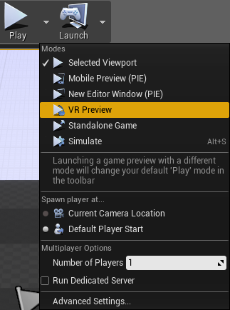

Getting Started with UE4's SteamVR on macOS Preview
====================================

About This Sample
-----------------

This code drop provides an experimental early preview of SteamVR on macOS support in UE4 as shown at Apple's Worldwide Developers Conference. This code is provided as-is and unsupported. Much of this support relies on Metal 2, which is still in beta, and subject to change before its eventual release this Fall.  We advise for shipping products to wait for official support, currently planned for 4.18.

Prerequisites
-------------

To run the sample, you will need to have the latest version of macOS 10.13 (High Sierra), as well as the latest version of Xcode installed (version 9.0 or later). You can download both directly from Apple at 
 
[https://developer.apple.com/xcode/downloads/](https://developer.apple.com/xcode/downloads/)
 
Download and copy Xcode-beta.app into your Applications directory next to your Xcode.app. In a Terminal window, enter this command (you will need an administrator password for this):

    sudo xcode-select -s /Applications/Xcode-beta.app/Contents/Developer
 
This will tell our tools to use the beta version of Xcode.
 
Additionally, you'll need an HTC Vive, along with the latest version of SteamVR, available for free through Steam.  Information on downloading and setting up SteamVR can be found here in our Quick Start guide:
 
[https://docs.unrealengine.com/latest/INT/Platforms/SteamVR/index.html](https://docs.unrealengine.com/latest/INT/Platforms/SteamVR/index.html)

Setting Up UE4
--------------

After cloning the repository and checking out the dev-vr-mac branch, run Setup.command in the repository root directory to download binary dependencies and content required to run UE4. 

Following that, run the GenerateProjectFiles.sh script in the root folder of your installation folder. This will generate UE4.xcworkspace in the same folder. Open this project in Xcode.
 
Once Xcode is open, select the ShaderCompileWorker scheme and build it.
 
When this is finished, select the UnrealLightmass scheme and build it.
 
When this is finished, select the UE4 scheme. Edit it to be sure the build configuration is Development Editor, then build and run. When the build is finished, it will launch the Unreal Project wizard.  For details on how to set up a new VR project, please see the following guide:
 
[https://docs.unrealengine.com/latest/INT/Platforms/SteamVR/QuickStart/2/index.html](https://docs.unrealengine.com/latest/INT/Platforms/SteamVR/QuickStart/2/index.html)
 
Additionally, once your project is created, open up the Project Settings (Edit, Project Settings), and enable both "Instanced Stereo" and "Multi-view" rendering under the VR Rendering settings.  This will maximize performance on the device.
 
Running on Device
-----------------

Before starting UE4, be sure to launch the SteamVR monitor by double clicking on "SteamVR" in Steam.  Verify that you can see the default SteamVR world (a white area with circular lines on the floor), and that your room is properly set up, as per the SteamVR Quick Start guide.
 
Launch the UE4 editor, and verify that the VR Preview button is available, as shown below:
 

 
If you do not see that button, be sure that the SteamVR monitor does not report any errors, and that the headset is plugged in properly.  If you do see the VR Preview button, congratulations, you're now ready to run VR on the Mac!

Current Limitations and Issues
------------------------------

Because this is preview code running on a beta operating system, there are a few limitations and issues to be aware of.
 
* SteamVR must be started and running before launching UE4.  If it is launched afterwards, UE4 might not be able to properly connect to the device.
* The HTC Vive must be plugged in and turned on before starting SteamVR.  This is a known issue with SteamVR, and will be addressed in an upcoming release.
* The desktop forward renderer is functional in this branch, but as of the time of writing, there is a bug in the Metal 2 implementation which prevents MSAA from working properly.  In the meantime, we recommend either temporal anti-aliasing, or FXAA.
* Because this branch was used for the WWDC stage demo of the VR Editor, some VR Editor functionality has been hardcoded into "Demo Mode," and may not be fully functional compared to the main branch.  We recommend not using this branch to explore VR Editor functionality.

Be Creative!
------------

What can you create with the power of UE4 and SteamVR on the Mac? Build on top of this drop and share your work with the UE4 community!  After the initial setup steps, all of the workflows that you're familiar with on the PC and mobile VR platforms are the same.  Please refer to our VR platform documents if you need any help:
 
[https://docs.unrealengine.com/latest/INT/Platforms/VR/index.html](https://docs.unrealengine.com/latest/INT/Platforms/VR/index.html)
 
Any details around your work are welcome in the [Unreal Engine WIP](https://forums.unrealengine.com/forumdisplay.php?11-Work-in-Progress) Forums.

Tweet to us! You can tag [@UnrealEngine](https://twitter.com/unrealengine) and use the #UE4 hashtag.
